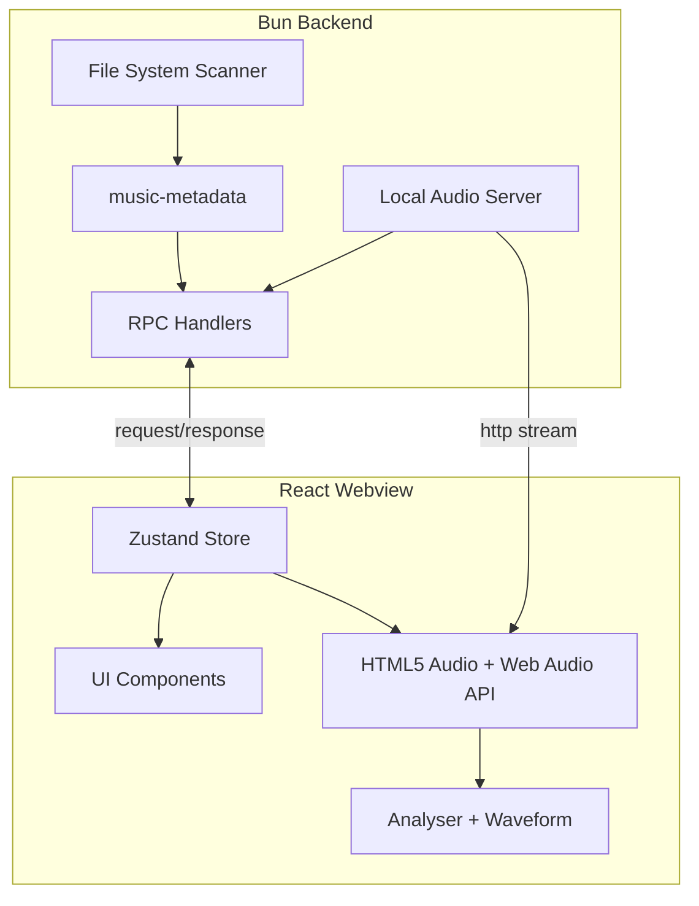

# Full-Featured Cross-Platform Music App

## Architecture Overview




---

## 1. Backend: Bun Process Enhancements

**Location:** [src/bun/index.ts](src/bun/index.ts), new `src/bun/` modules

### 1.1 RPC Schema Extension

Extend [src/shared/rpc-types.ts](src/shared/rpc-types.ts) with `bun.requests`:

- `getDefaultMusicPath` → `string` (platform-specific: `%USERPROFILE%\Music` on Windows, `~/Music` on macOS/Linux)
- `scanFolders` → `{ paths: string[] }` → `{ files: { path: string; ext: string }[] }` (recursive, audio extensions only)
- `getTrackMetadata` → `{ path: string }` → `{ title, artist, album, duration, genre, picture?: string }` (base64 cover)
- `getPlaybackUrl` → `{ path: string }` → `string` (localhost URL for streaming)
- `addFolder` / `removeFolder` / `getWatchFolders` → persist in app data
- `loadPlaylist` → `{ path: string }` → `{ name, entries: { path, title? }[] }`
- `savePlaylist` → `{ path: string; name: string; entries: string[] }` → void
- `listPlaylists` → scan app data folder for `.m3u8` files

### 1.2 Local Audio Server

- Start minimal HTTP server (e.g. `Bun.serve`) on random high port (e.g. 38473–49151) when app launches
- Route: `GET /play?path=<url-encoded-absolute-path>`
- Stream file with correct `Content-Type` (audio/mpeg, audio/flac, etc.) and `Content-Length`
- Validate path is under a watched folder to prevent path traversal
- Use `Bun.file(path).stream()` for efficient streaming

### 1.3 Metadata Pipeline

- **Library:** `music-metadata` (Node/Bun, supports MP3, FLAC, M4A, OGG, WAV, etc.)
- Recursive scan: `fs.readdirSync(path, { recursive: true, withFileTypes: true })` + filter by extension
- Supported extensions: `.mp3`, `.m4a`, `.aac`, `.flac`, `.ogg`, `.opus`, `.wav`, `.aiff`, `.webm`
- Batch metadata: parse in parallel with `Promise.all` + concurrency limit (e.g. 10) to avoid blocking
- Cache metadata in memory (path → metadata) to avoid re-parsing on re-render
- Extract embedded picture as base64 for cover art

### 1.4 Platform Paths

- Use `process.platform` and `process.env.USERPROFILE` (Win) / `process.env.HOME` (macOS/Linux)
- Windows default: `path.join(process.env.USERPROFILE!, 'Music')`
- macOS/Linux: `path.join(process.env.HOME!, 'Music')`

### 1.5 Settings Persistence

- Store watched folders and playlist paths in JSON file under app data:
  - Windows: `%APPDATA%/winampplayer.electrobun.dev/settings.json`
  - macOS: `~/Library/Application Support/winampplayer.electrobun.dev/settings.json`
  - Linux: `~/.config/winampplayer.electrobun.dev/settings.json`
- Use `path.join(os.homedir(), ...)` for cross-platform resolution

---

## 2. Frontend: State & Data

### 2.1 Zustand Store

**New file:** `src/mainview/store/playerStore.ts`

- Slices: `library`, `playlists`, `player`, `settings`, `theme`
- `library`: `tracks: Track[]`, `loading: boolean`, `error: string | null`
- `playlists`: `items: Playlist[]`, `activeId: string | null`
- `player`: `currentTrack`, `queue`, `isPlaying`, `currentTime`, `volume`, `audioRef`
- `settings`: `watchFolders: string[]`, `lastFolder?: string`
- `theme`: `accentColor: string`, `palette: string[]` (from album art)

Actions: `loadLibrary`, `addFolder`, `removeFolder`, `playTrack`, `togglePlay`, `setVolume`, `updateTheme`, `loadPlaylist`, `savePlaylist`, `createPlaylist`

### 2.2 Track Type Extension

Update [src/mainview/types.ts](src/mainview/types.ts):

```ts
interface Track {
  id: string;           // path-based or hash
  path: string;        // absolute path
  title: string;
  artist: string;
  album: string;
  time: string;        // "3:45"
  genre: string;
  picture?: string;    // base64 data URL
}
```

### 2.3 Electroview RPC Access

- Pass `electrobun` (Electroview instance) to store or a context so components can call `electrobun.rpc.request('getDefaultMusicPath')` etc.
- Implement async thunks in store that call RPC and update state

---

## 3. Audio Playback & Visualization

### 3.1 Real Audio Playback

- Single `<audio>` element (hidden) driven by store
- On `playTrack(track)`:
  1. Call RPC `getPlaybackUrl(track.path)` → get `http://127.0.0.1:xxxx/play?path=...`
  2. Set `audio.src = url`, `audio.play()`
  3. Wire `timeupdate`, `ended`, `error` to store

### 3.2 Web Audio API Setup

- `AudioContext` + `createMediaElementSource(audio)` → `AnalyserNode` → `destination`
- `analyser.fftSize = 256` (or 512) for bars; `getByteFrequencyData()` for frequency visualization
- `getByteTimeDomainData()` for waveform
- Use `requestAnimationFrame` loop to sample and update visualization state

### 3.3 Visualization Components

**Update** [src/mainview/components/Visualizer.tsx](src/mainview/components/Visualizer.tsx):

- Accept `analyserData: Uint8Array | null` prop
- Map frequency bins to bar heights
- Fallback to current CSS animation when no analyser data (e.g. loading)

**New:** `src/mainview/components/Waveform.tsx`

- Canvas-based time-domain visualization
- Draw waveform from `getByteTimeDomainData()`
- Optional: minimap-style for scrubber integration

---

## 4. Dynamic Theme from Album Art

### 4.1 Color Extraction

- **Library:** `colorthief` (or `@dominant-color/core`) — extract dominant color from cover image
- When `currentTrack` changes and has `picture`:
  1. Create `Image` from base64, draw to canvas
  2. Use Color Thief `getColor()` → RGB
  3. Generate palette: darken/lighten for `--color-winamp-accent`, `--color-winamp-bar`, etc.
  4. Apply via CSS variables on root or a theme wrapper

### 4.2 CSS Variable Override

- Default green palette stays as fallback in [src/mainview/index.css](src/mainview/index.css)
- Theme provider updates `document.documentElement.style` with `--color-winamp-accent`, `--color-winamp-bar`, etc.
- Smooth transition: `transition: color 0.3s, background-color 0.3s` on key elements

---

## 5. Folder Management UI

### 5.1 Settings / Folders View

- New nav item: "Folders" or under Settings
- List watched folders with remove button
- "Add Folder" button → RPC / Electrobun `Utils.openFileDialog` with `mode: 'folder'` (if available) or use a simple path input + validation
- On add: append to `watchFolders`, persist, trigger `loadLibrary`

### 5.2 First-Run / Empty State

- If no folders configured, show "Add your Music folder" with default path (e.g. Windows Music) as one-click
- "Browse" to pick different folder

---

## 6. Playlist Management

### 6.1 Standards

- **Import:** M3U, M3U8 (UTF-8), PLS — parse in Bun
- **Export:** M3U8 (extended with #EXTINF when possible)
- **Storage:** `~/.../playlists/*.m3u8`

### 6.2 Playlist UI

- Sidebar: list playlists (from `listPlaylists` + in-memory)
- Create playlist: modal → name → save as new .m3u8
- Add to playlist: context menu on track → "Add to Playlist" → select
- Drag-and-drop tracks into playlist (optional, nice-to-have)
- Import: "Import playlist" → open file dialog → parse and add to library view
- Export: "Export" → save .m3u8 to user-chosen path

---

## 7. Library Loading Flow

1. App mount → read settings → if empty, set default Music path
2. Call `scanFolders(watchFolders)` → get file list
3. Batch `getTrackMetadata` (with concurrency limit)
4. Merge into `library.tracks`, dedupe by path
5. Show loading skeleton during scan
6. Persist folder list on add/remove

---

## 8. File Structure

```
src/
├── bun/
│   ├── index.ts              (existing + server + RPC)
│   ├── audioServer.ts        (Bun.serve for streaming)
│   ├── metadata.ts           (music-metadata wrapper)
│   ├── paths.ts              (platform paths, app data)
│   └── playlists.ts          (M3U/M3U8/PLS parse & write)
├── mainview/
│   ├── store/
│   │   └── playerStore.ts
│   ├── hooks/
│   │   ├── useAudioEngine.ts  (AudioContext + Analyser)
│   │   └── useThemeFromArt.ts
│   ├── components/
│   │   ├── Visualizer.tsx    (frequency bars)
│   │   ├── Waveform.tsx      (time-domain)
│   │   └── ...
│   └── ...
└── shared/
    ├── rpc-types.ts
    └── constants.ts           (AUDIO_EXTENSIONS, etc.)
```

---

## 9. Dependencies


| Package          | Purpose                            |
| ---------------- | ---------------------------------- |
| `music-metadata` | Metadata + embedded art extraction |
| `zustand`        | State management                   |
| `colorthief`     | Dominant color from image          |


No new runtime deps for M3U/PLS parsing — implement lightweight parser in Bun.

---

## 10. Implementation Order

1. Extend RPC schema + implement Bun handlers (paths, scan, metadata, server)
2. Add audio server and playback URL flow
3. Implement Zustand store and wire RPC
4. Replace mock data with real library in `MainWindow`
5. Add folder management UI and persistence
6. Implement real audio element + Web Audio analyser + update Visualizer
7. Add Waveform component
8. Implement theme extraction and CSS variable updates
9. Playlist import/export and CRUD
10. Polish: loading states, error handling, empty states

---

## 11. Cross-Platform Notes

- **Paths:** Always use `path.join()` and `path.normalize()`; handle Windows backslashes
- **Audio server:** Bind to `127.0.0.1` for security
- **Electrobun Utils:** Check `Utils.openFileDialog` / `Utils.openPath` for folder picker — fallback to path input if unavailable
- **Strict mode:** Enable `strict: true` in tsconfig; use `!` sparingly with proper guards

---

## 12. Open Questions Resolved

- **Audio URL:** Localhost HTTP server (no `file://` due to webview security)
- **Playlist format:** M3U8 for save; support M3U/M3U8/PLS on import
- **Theme:** CSS variables + Color Thief from track picture; default green remains fallback

